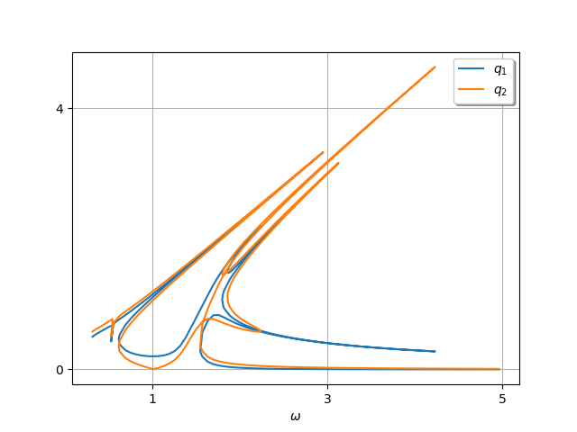

The example is taken from [A Python Implementation of a Robust Multi-harmonic Balance with Numerical Continuation and Automatic Differentiation for Structural Dynamics](https://doi.org/10.1115/1.4062424)

$$\begin{bmatrix} 1 & 0 \\ 
0 & 1 \end{bmatrix} \begin{bmatrix}\ddot{q}_1 \\ 
\ddot{q}_2 \end{bmatrix}+ \begin{bmatrix} 0.01 & 0 \\
0 & 0.01 \end{bmatrix} \begin{bmatrix}\dot{q}_1 \\
\dot{q}_2 \end{bmatrix}+ \begin{bmatrix} 1 & -1 \\
-1 & 1 \end{bmatrix} \begin{bmatrix} q_1 \\
q_2 \end{bmatrix} + \begin{bmatrix} q_1^3 \\
q_2^3\end{bmatrix}=\begin{bmatrix} 0 \\
0.2 \cos(\omega t)\end{bmatrix}
$$

