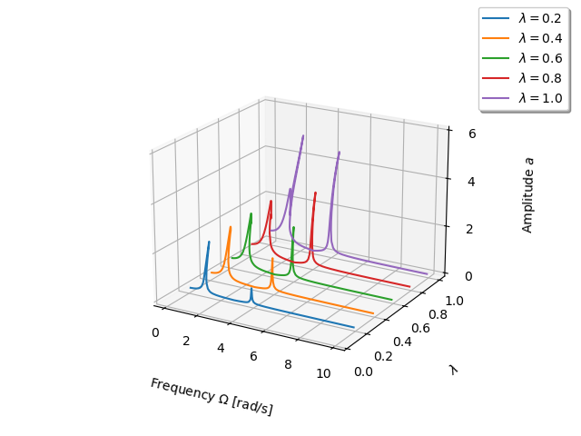

The example is taken from [Tracking Amplitude Extrema of Nonlinear Frequency Responses using the Harmonic Balance Method](https://doi.org/10.1002/nme.7376)

$$m \ddot{x} + c\dot{x} + k x + k_2 x^2 + k_3 x^3 = \lambda \sin(\Omega t)$$

$$ \begin{bmatrix} m_1 & 0 \\ 
0 & m_2 \end{bmatrix} 
\begin{bmatrix} \ddot{x_1} \\ 
\ddot{x_2} \end{bmatrix} +
\begin{bmatrix} c_1 + c_{12} & -c_{12} \\
-c_{12} & c_2 + c_{12} \end{bmatrix}
\begin{bmatrix} \dot{x_1} \\
\dot{x_2} \end{bmatrix} +
\begin{bmatrix} k_1 + k_{12} & -k_{12} \\
-k_{12} & k_2 + k_{12} \end{bmatrix}
\begin{bmatrix} x_1 \\
x_2 \end{bmatrix}+
\begin{bmatrix} k_3 x_1^3 \\
0 \end{bmatrix} =
\begin{bmatrix} \lambda \sin(\Omega t) \\ 
0 \end{bmatrix}
$$

