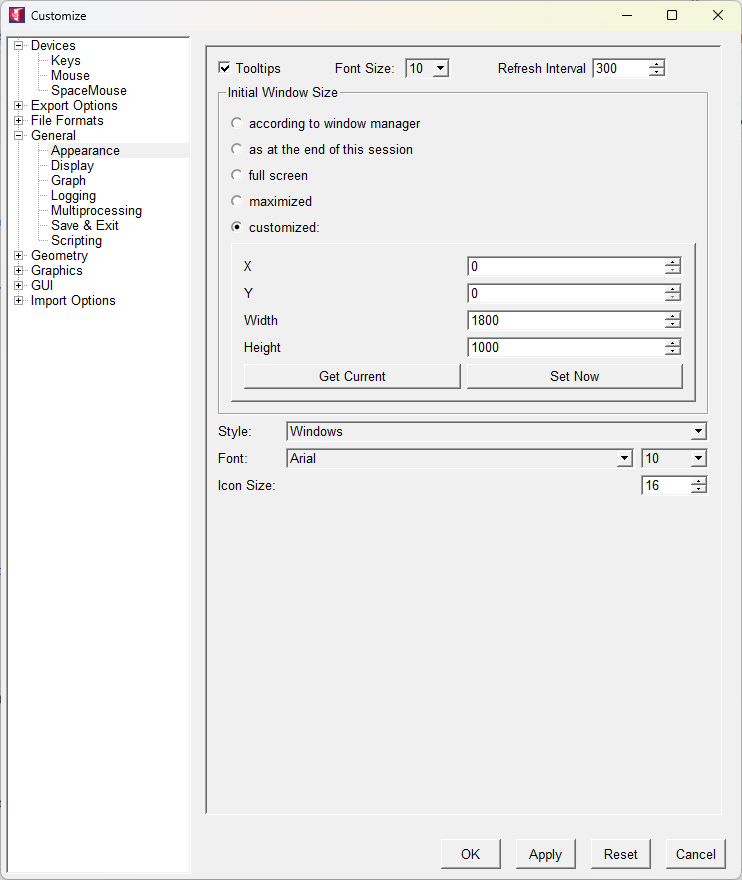
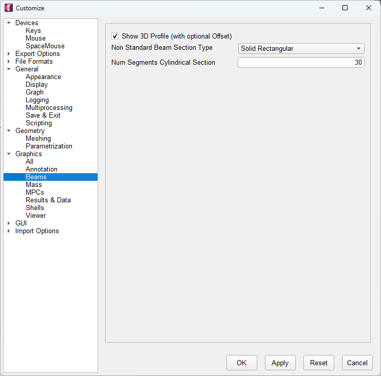
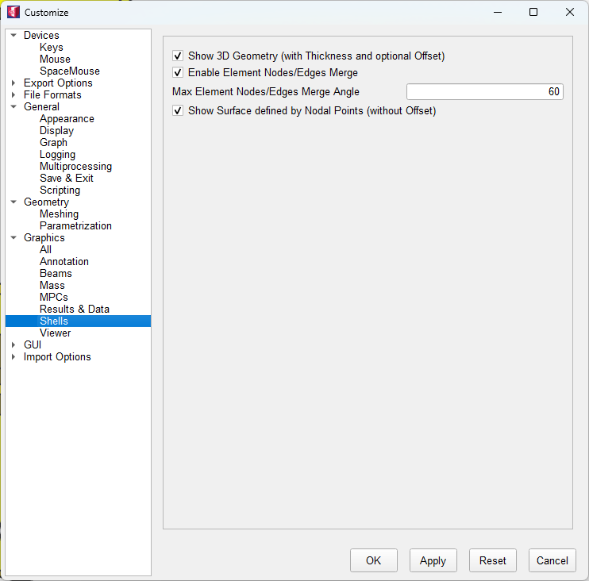

### Frequently Asked Questions

#### Semi-transparent RenderArea shows other windows behind the VisPER MainWindow

On KDE desktops you can look for the Compositor Settings in the System Settings Module and uncheck the checkbox at Enable compositor at startup.  
On Gnome desktops you may use the environment variable setting

``` 
export XLIB_SKIP_ARGB_VISUALS=1
```

#### Modal dialog (e.g. ChooseElements, ChooseNodes) cannot be moved from RenderArea (Desktop: Gnome)

Gnome decided to behave like MacOS for modal dialog windows [https://en.wikipedia.org/wiki/Modal_window] and forces such a window to stay above its mother window.
For example, if you pick a node in VisPER where more than one node is positioned, the modal ChooseNodes dialog window pops-up and presents a table with all nodes near the picked point. Since you want to see graphical feedback for the referencing element of the selected node in table you may want to move the ChooseNodes dialog away from the RenderArea. This may not be possible if you run VisPER on a Gnome desktop.
To allow modal dialog windows to be moved independent of their mother window on Gnome desktops do the following setting once in a shell console:
``` 
gsettings set org.gnome.mutter attach-modal-dialogs false
```
#### Black screen on Windows

Check the output of dxdiag. This tool is used to collect info about devices to help troubleshoot problems with DirectX sound and video.
Try to manually set the GL Renderer to use your NVIDIA graphics card instead of the Intel HD graphics via the following steps:
* NVIDIA Control Panel 
    + 3D Settings
    + Manage 3D settings
    + Click on “Program Settings” tab
    + Select a program to customize, e.g. C:\Program Files\INTES\EDU\PermVis\M9v20\bin\visper.exe
    + Select the preferred graphics processor for this program: High-performance NVIDIA processor 
    + Click “Apply”

#### Standard colors

There exists several possibilities to modify standard colors in VisPER by using additional definitions in the startup.pm.
The user-specific configuration file startup.pm can be found under
   + ~/.visper/20.0-EDU/startup.pm on Linux
   + %APPDATA%/Intes/VisPER/20.0-EDU/startup.pm on Windows  

* Option I
  
```python
def initColorGenerator(obj):
    obj.labelOffset = 1
```
* Option II

```python
def getColorIndexOfElemGroup(eg):
    if not eg:
        return 0
    return 317 if (eg.index == 1 and eg.typeName == 'Part') else eg.index
```
* Option III

```python
def getColorOfElemGroup(eg):
    return Color(200/255,230/255,200/255) if (eg and eg.index == 1) else eg.index
```

  ### 4K Monitor

  Adjust Windows Display Scaling. **Right-click** on the desktop and select **Display settings**.
  Under **Scale & layout**, choose a recommended scaling level e.g. 100% or 150%

  
 
### Fusion style


### Rendering of beam and shell elements






